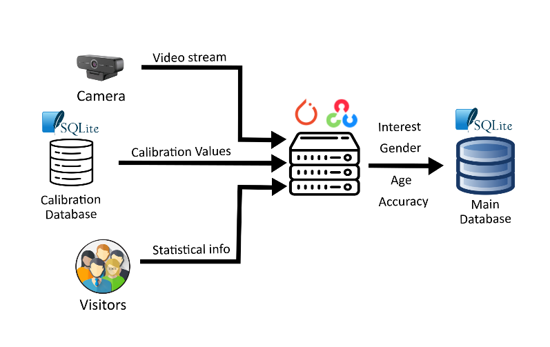

# gazePainting

  
Table of Contents

  <ol>
    <li><a href="#introduction">Introduction</a></li>
    <li><a href="#network-architectures">Network architectures</a></li>
    <li><a href="#calibration-mechanism">Calibration mechanism</a></li>
    <li><a href="#system-architecture">System architecture</a></li>
    <li><a href="#project-authors">Project Authors</a></li>
  </ol>

## Introduction
Multiple objectives were present in this project:
- Assessing a visitor's interest in a artwork. This interest can be estimated by various factors, one of which is certainly the time a person looks at the artwork. [An additional one could be the change in facial microexpressions, more difficult to interpret though].
- Obtaining an estimate of the age and gender of the visitor
- Organization and visualization of the data obtained

The problem of how much a person looks at an artwork can be decomposed and solved through the combination of gaze estimation and face tracking procedures. Instead, to be able to obtain demographic information, age and gender estimation techniques must be used.
A simple webcam combined with deep learning technologies can be used to obtain an estimate of the direction in which a subject is looking and the position of his or her face without using specific equipment.

## Network architectures
Several network architectures were used in this project:
- As for the gaze estimation part, I used the "L2CS-NET" network ([here](https://github.com/ahmednull/l2cs-net)). This network is based on ResNet50, a 50-layer  network capable of recognizing and classifying 1000 categories [including animals, vehicles, objects] trained through millions of images. The researchers exploited this network with great generalization capabilities to extract features on gaze, to be then processed by connected layers and thus obtain an estimate of pitch angle and yaw angle.

- For face tracking, the RetinaFace tool ([here](https://github.com/elliottzheng/face-detection)) was used with the purpose of obtaining information on bounding boxes and assigned IDs. This tool is also based on ResNet50. To update the position of the faces between frames the object tracking code was extracted from an [online repo](https://pysource.com/2021/01/28/object-tracking-with-opencv-and-python/) made by PySource

- For age and gender estimation instead, I used another ConvNet based on the network discussed in "Age and Gender Classification Using Convolutional Neural Networks" by Gil Levi and Tal Hassner which can provide the most likely range of the subject's age and gender. They also present a [repo](https://github.com/GilLevi/AgeGenderDeepLearning) with the implemenation.

As libraries, Pytorch was used to optimize the tensor calculation with use of GPU and OpenCV for the processing and handling part of the incoming video stream from the camera.

**Note**: The network used for age and gendere estimation appears to be rather dated and inaccurate. In addition, the tracking mechanism can be improved by adding more complex features for maintaining IDs between frames in which the object is occluded. For these reasons, it would be recommended to upgrade these features with better performing systems. An example would be The MiVOLO project ([link here](https://github.com/WildChlamydia/MiVOLO)) and the YOLO project([link here](https://docs.ultralytics.com/))
  
## Calibration mechanism
The neural network provides two angles to estimate where a person is looking. However, to understand whether a person is looking at a work of art also requires a calibration mechanism that can obtain information about the range of viewing angles at which a person can observe a work of art. This calibration involves having the operator stand at two points "considered extreme for viewing" and observe the four angles of the artwork. From the photos taken at these positions, angle values will be obtained, which will then be used at run time by the script.

## System architecture
The principle scheme of the system is as follows: the video stream arriving from the webcam is captured and processed by the computer. The data obtained is saved in the database, and then the user can view this data by requesting it through a WebApp.

Let us now go into more detail about the various stages.

### Phase 1: Calibration
The first phase is the calibration phase.
Each work having its particular characteristics will have to go through this phase, where the presence of an operator will also be needed to finish the calibration. The images of the operator observing the work will be acquired and processed with the use of OpenCV and then Pytorch will be used to obtain an estimate of the calibration angles for that particular work. These calibration values will be saved in the SQLite "Calibration Database."

### Phase 2: Data gathering
The second phase is data gathering.
In this phase we exploit the previously found calibration values to obtain information about visitor interest in a particular artwork.
Again the video stream will be handled by OpenCV, while Pytorch will perform both the gaze estimation part and the age and gender estimation part. In the end we will get values for the seconds for which a visitor observed the work, demographic data (age and gender) and also the confidence value on these obtained demographic data . All these values will be saved in the SQLite "Main Database."

### Phase 3: User Interaction
In the third phase we have all the mechanism that allows interaction with the user through a WebApp. As a backend to manage this WebApp, the Flask framework and the SQLite toolkit is used to access the Main Database and retrieve the information obtained in the previous phase. The Jinja2 template engine is used to generate the user viewable Web pages . Demographic data is processed and made easily viewable through charts created with the use of the data visualization library called Chart.js

Below is a demo showing the use of the WebApp.

## Project Authors
This project was carried out by Jacopo Damerini as a thesis project for his bachelor's degree in Electronic and Telecommunications Engineering at the University of Florence.

The project assignment was directed by: 
* Marco Bertini - Associate Professor - Università degli Studi di Firenze

The project was developed by:
* Jacopo Damerini - Student - Florence (Italy)
